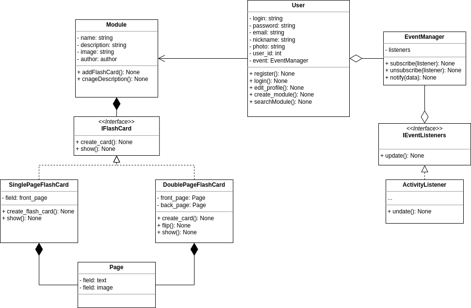

# **OOP 2023 COURSE PROJECT**

Student: Sivy Andrei Aleksandrovich

Group: 153504

___

## Topic

*Automated Learning System(ATS)* for learning foreign languages.

___

## Description of project

*Automated Learning Systems (ATS)* are software and hardware complexes that include methodological, educational and organizational support for the learning process based on information technology. The idea of project is an application for learning foreign languages using flash-cards. Flash-cards is a way of remembering information. A system familiar to many from school, which is most often used to memorize words. A card is an ordinary piece of paper, cardboard or a picture in electronic form with one or two working sides. 

The application provides a simple and user-friendly interface for creating, storing and visualizing flashcards. Interaction with cards is very simple: you read a term, try to remember its meaning, and then turn the card over and check the actual meaning of the term. All cards are stored in modules. Many users can use ready-made modules or create their own modules and share them with others. Each module has a title and information about it. For example, it is usefull to group flash-cards acording topics or other criteria.

___

## Functional Requirements

- [ ] *Registration and authorization system.* Allows users to log in with parameters such as username, email, and password. 

- [ ] *User profiles.* Displays the main information about the user, his activity and added modules.

- [ ] *Searching system.* Provides the ability to search for public modules by different criteria. For example, you can find a module published by your teacher. Or you can find modules according your language level.

- [ ] *Flash-card creating.* Provides an opportunity of creating modules of custom flash-cards. You can customize flashcards as you want. Both sides of flashcard consists of terms, images or gifs. If necessary, it is possible to learn the pronounciation.

- [ ] *Flash-card visualization.* First of all you see the term in the front page of flash-card. You try to remember the meaning of this term. After that you flip the flash-card and check the right meaning of the term. There are an opportunity to see transcription or to listen to the pronunciation of the word. If you remember this term, you can mark it and it will not be shown again

- [ ] *Activity system* Allows you to track your statistics in learning words. You can see information about the number of words learned, the frequency and duration of the sessions, etc. It is possible to get statistics for a certain period of time.
___

## System class diagram

___

## List of base functions

+ ***add_user*** - addes new user account
+ ***show_card*** - shows the flash-card
+ ***flip_card*** - flips the flash-card
+ ***create_card*** - creates new flash-card
+ ***create_module*** - creates new module
+ ***search_module*** - searches module
___

## Description of data models
+ .json, .xml - data format for exchanging textual imformation
+ .py - system script files
+ .png, .jpg, .jpeg, .gif - visual content